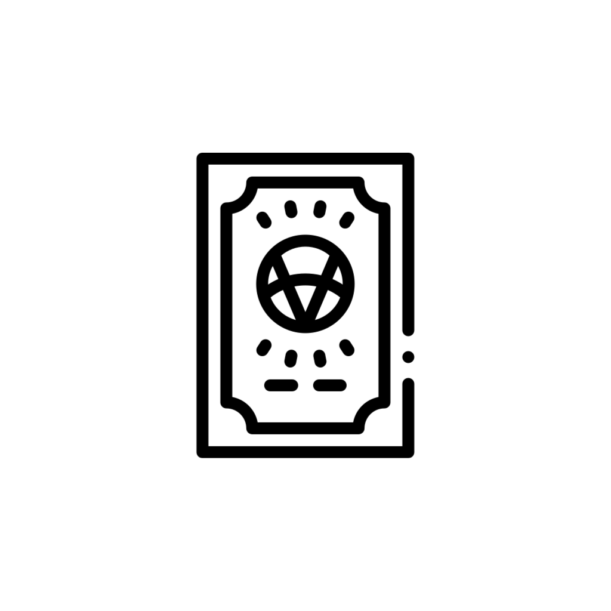
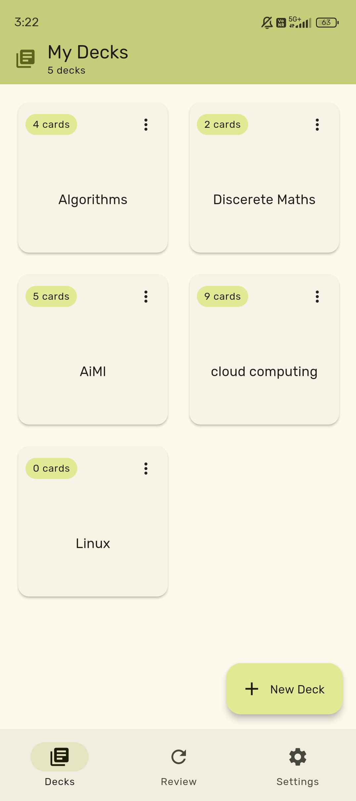
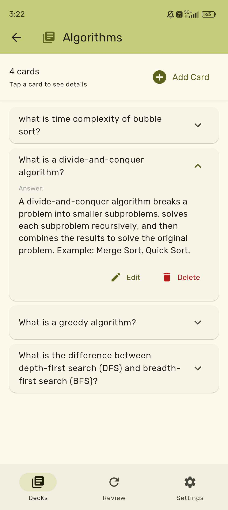
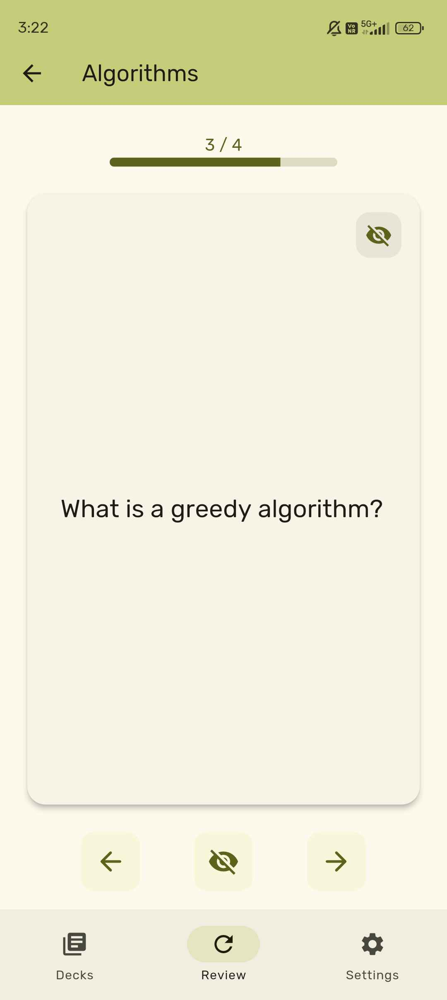
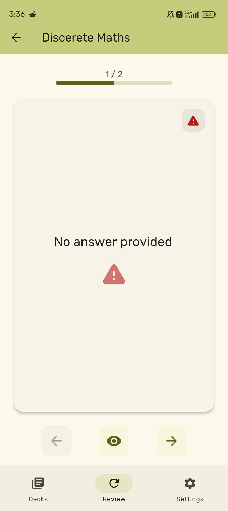
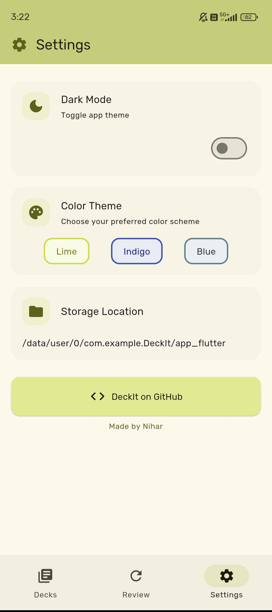

<div align="center">



# DeckIt - FlashCards App  [](https://github.com/nuanv/DeckIt/actions/workflows/flutter-ci.yml)
   </br>
   <div>
      
      
      
      
      
      
   </div>
</div>

<br>

## Getting Started

### Prerequisites

Ensure you have the following installed on your development machine:

- Flutter SDK
- Dart SDK
- A suitable IDE such as Visual Studio Code or Android Studio
- An emulator or physical device for testing

### Installation

1. Clone the repository from GitHub:

   ```sh
   git clone https://github.com/nuanv/DeckIt.git
   ```

2. Navigate to the project directory:

   ```sh
   cd DeckIt
   ```

3. Install the necessary dependencies:

   ```sh
   flutter pub get
   ```

4. Run the application:

   ```sh
   flutter run
   ```

## Features

- Locally stores the data.

- Easy to use and user-friendly.

- [Material Design 3](https://m3.material.io/) style UI, with dynamic color theme.
